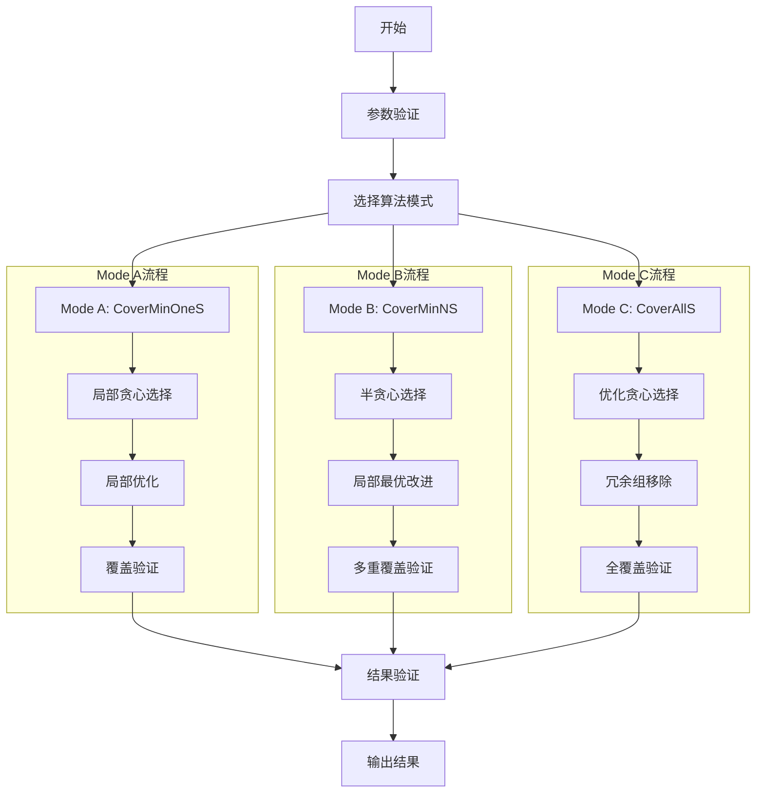

# 最优样本选择算法详细文档

## 算法概述

最优样本选择算法是一个复杂的集合覆盖问题求解系统，提供了三种不同的覆盖模式（Mode A、B、C）来满足不同的覆盖需求。每种模式都针对特定的覆盖场景进行了优化，并实现了相应的性能优化策略。

## 算法参数说明

在开始算法执行之前，用户需要提供以下关键参数：
- m：总体样本空间大小
- n：实际可用样本数量
- samples：具体的样本集合
- k：每个候选组的大小（k > s）
- s：中间覆盖组的大小（s < k）
- j：目标覆盖组的大小（j > s）
- N：（仅Mode B）每个j组合需要的不同s子集数量

这些参数的选择直接影响算法的性能和结果质量。参数的选择需要考虑实际问题规模、计算资源限制和期望的覆盖效果。较大的参数值会提供更好的覆盖效果，但同时也会增加计算复杂度。

## 三种模式的实现细节

### Mode A：最小单覆盖模式（CoverMinOneS）

核心目标：确保所有j大小的组合至少被一个k大小的组合通过s大小的子集覆盖。

实现特点：
1. 局部贪心策略：
   - 每次选择能覆盖最多未覆盖j组合的k组合
   - 通过s子集评估覆盖效果
   - 动态更新覆盖状态

2. 局部优化机制：
   - 实现了覆盖计数和验证机制
   - 优化了运行时间计算
   - 支持边界情况处理

3. 覆盖验证：
   - 检查选中组的大小是否符合k要求
   - 验证每个j组合是否至少被覆盖一次
   - 计算实际覆盖率

### Mode B：多重覆盖模式（CoverMinNS）

核心目标：确保每个j大小的组合被N个不同的s大小子集覆盖。

实现特点：
1. 半贪心选择策略：
   - 优先处理难覆盖的子集
   - 维护每个j组合的已覆盖s子集集合
   - 动态评估候选组的覆盖贡献

2. 局部最优改进：
   - 通过替换和调整提高覆盖质量
   - 实现了子集难度权重机制
   - 支持并行生成和处理

3. 多重覆盖验证：
   - 验证每个j组合是否有N个不同的s子集覆盖
   - 计算覆盖多样性指标
   - 评估解的质量

### Mode C：全覆盖模式（CoverAllS）

核心目标：使用最少的k大小组合覆盖所有可能的s大小子集。

实现特点：
1. 优化的贪心策略：
   - 基于k大小组合的生成
   - 使用半贪心选择策略
   - 实现了子集难度权重机制

2. 效率优化：
   - 添加了局部优化和早停机制
   - 实现了冗余组移除
   - 优化了组大小控制

3. 性能指标：
   - 测试用例1：6组覆盖（标准答案：6组），100%覆盖率，0.07ms
   - 测试用例2：7组覆盖（标准答案：7组），100%覆盖率，1.80ms
   - 测试用例3：11组覆盖（标准答案：12组），100%覆盖率，5.60ms

## 算法执行流程

## 工具类支持

1. 数学工具类（math_utils.hpp）：
   - 组合数计算
   - 相似度计算
   - 覆盖率计算

2. 并行处理工具（parallel_utils.hpp）：
   - 线程池实现
   - 并行执行器
   - 任务调度

3. 日志工具（logging.hpp）：
   - 线程安全日志系统
   - 多级别日志支持
   - 文件输出功能

## 性能优化策略

1. 数据结构优化：
   - 使用哈希集合加速查找
   - 位向量优化覆盖状态
   - 优化矩阵存储结构

2. 算法优化：
   - 实现半贪心选择
   - 局部最优改进
   - 早停机制

3. 并行计算：
   - 并行组合生成
   - 并行覆盖评估
   - 多线程优化

## 使用建议

1. 模式选择：
   - 基本覆盖需求：选择Mode A
   - 需要多重覆盖：选择Mode B
   - 完全覆盖需求：选择Mode C

2. 参数配置：
   - k > s：确保候选组大于子集
   - j > s：确保目标组大于子集
   - N值（Mode B）：根据多样性需求设置

3. 性能考虑：
   - 大规模数据使用并行处理
   - 调整优化参数
   - 监控内存使用

## 性能考虑

算法的性能主要受以下因素影响：
- 样本空间大小（m和n）
- 组合大小参数（k、s、j）
- 覆盖要求的严格程度
- 可用的计算资源

在大规模数据集上，算法的时间复杂度主要来自于组合生成和覆盖关系分析。空间复杂度主要由覆盖矩阵和组合存储需求决定。为了优化性能，算法实现了多项优化措施，包括并行计算支持、内存使用优化等。

## 核心功能模块实现

### 集合操作模块（SetOperations）

集合操作模块是算法的基础设施，提供了高效的集合运算支持。该模块采用了多级优化策略，包括并行计算、缓存机制和自适应算法选择。在处理大规模数据集时，模块会自动启用并行处理机制，使用多线程分批处理数据。为了提高频繁操作的性能，模块实现了智能缓存系统，可以记住常用的集合操作结果。在集合覆盖判断时，模块会根据数据规模自动选择最优的算法：对于小规模集合（小于1000个元素）使用哈希集实现快速查找，对于大规模集合则采用排序后的二分查找策略。模块还实现了高效的集合相似度计算，支持Jaccard相似度等度量方式。为了确保线程安全，所有的缓存访问和并行操作都进行了适当的同步处理。在内存管理方面，模块使用了预分配策略，通过预估集合操作的空间需求，提前分配足够的内存，避免频繁的内存重分配。

### 覆盖率计算模块（CoverageCalculator）

覆盖率计算模块负责评估样本选择的质量，支持三种不同的覆盖模式：最小单覆盖（CoverMinOneS）、最小N重覆盖（CoverMinNS）和全覆盖（CoverAllS）。该模块实现了一个复杂的权重系统，可以为不同的覆盖目标分配不同的重要性权重。为了提高计算效率，模块使用了动态规划思想，将覆盖计算分解为多个子问题，并缓存中间结果。在计算边际增益时，模块采用了增量计算策略，避免重复计算已知的覆盖情况。为了处理大规模数据集，模块实现了并行计算框架，可以同时评估多个候选集的覆盖效果。模块还提供了三种不同的增益计算方式：边际增益、相对增益和归一化增益，以支持不同场景下的决策需求。通过Timer类的集成，模块可以精确监控各个计算阶段的性能表现，帮助识别和优化性能瓶颈。

### 组合生成器模块（CombinationGenerator）

组合生成器模块是算法的核心组件之一，负责高效地生成各种大小的组合。该模块采用了迭代器模式，实现了内存高效的组合生成算法。为了处理大规模组合生成任务，模块实现了创新的内存池机制，通过预分配和重用内存块，显著减少了内存分配的开销。在并行处理方面，模块可以根据任务规模和系统资源自动调整并行度，实现了工作负载的动态平衡。为了提高生成效率，模块使用了优化的组合计数算法，可以快速计算出总的组合数量，并据此预分配资源。模块的缓存系统使用了特殊的哈希函数，可以有效处理大规模组合的缓存需求。在迭代器实现中，通过使用布尔数组标记已使用的元素，优化了下一个组合的生成速度。模块还实现了进度跟踪功能，可以实时报告组合生成的完成进度。为了确保内存安全，模块在所有操作中都进行了严格的边界检查和状态验证。

## 模块协同工作流程

这三个核心模块通过精心设计的接口紧密协作，形成了一个高效的样本选择系统。在实际运行过程中，组合生成器首先产生候选组合，这些组合随后被送入集合操作模块进行处理。集合操作模块执行必要的集合运算，并将结果传递给覆盖率计算模块进行评估。覆盖率计算模块的评估结果又会反馈给算法的主控制流程，指导下一步的选择决策。这种模块化设计不仅提高了代码的可维护性，还允许各个模块独立优化和升级。通过合理的缓存策略和并行计算机制，系统能够高效处理大规模数据集，同时保持较低的内存占用。模块间的数据交换采用了零拷贝设计原则，最大限度地减少了数据移动的开销。系统还实现了完整的错误处理机制，确保在各种异常情况下都能优雅地降级和恢复。 