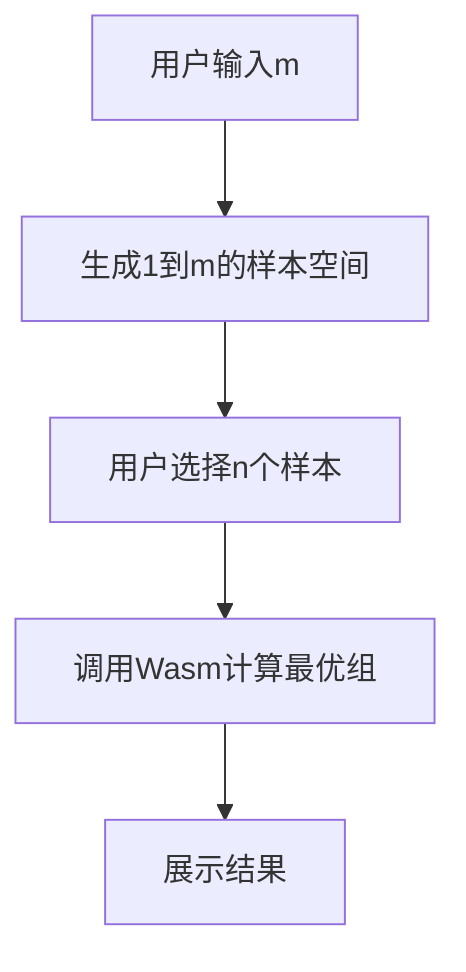

# Optimal Samples Selection System

## 1. Project Goal

This project aims to develop a system that finds an optimal (or near-optimal) set of sample groups based on user-defined parameters, following the specifications outlined in the CS360/SE360 Group Project description. The system will provide a user interface for parameter input and result display, and will be packaged for offline use on both Windows and Android platforms.

## 2. Problem Definition (Current Understanding)

Given the following inputs:
*   `m`: The maximum value for the total sample range (integer, 45 <= m <= 54). Samples are represented by integers from 1 to `m`.
*   `n`: The number of initial samples selected from the total range (integer, 7 <= n <= 25).
*   `initialSamples`: A set/list of `n` unique integers representing the selected samples (from 1 to `m`).
*   `k`: The size of each output group (integer, 4 <= k <= 7, typically 6).
*   `j`: An integer constraint parameter (s <= j <= k).
*   `s`: The size of the target subsets involved in the coverage goal (integer, 3 <= s <= 7).
*   `coverageMode`: A user-selectable parameter indicating the desired coverage objective.

The system aims to find a **minimum-sized collection `C` of `k`-element subsets** (groups) derived from `initialSamples` that satisfies the user-selected `coverageMode`. The supported modes are:

*   **Mode A (CoverMinOneS):** Ensure that **for every `j`-element subset `J`** of `initialSamples`, there exists at least one `k`-element subset `G` in `C` such that `G` contains **at least ONE** `s`-element subset of `J`.
*   **Mode B (CoverMinNS):** Ensure that **for every `j`-element subset `J`** of `initialSamples`, there exists at least one `k`-element subset `G` in `C` such that `G` contains **at least N** `s`-element subsets of `J`. (Note: The value of N should be provided as a user input parameter).
*   **Mode C (CoverAllS):** Ensure that **every `s`-element subset** of `initialSamples` is contained within at least one of the `k`-element subsets in the collection `C`.

The parameter `j` acts as a constraint for `s` and is crucial for defining the scope in Modes A and B.

## 3. Solution Architecture

We will adopt a Monorepo structure to manage the different parts of the project. The core architecture is as follows:

*   **Core Algorithm:** Implemented in **C++** for performance, focusing on the set cover problem defined above.
*   **Cross-Platform Logic:** The C++ core algorithm will be compiled into **WebAssembly (Wasm)**, allowing it to be executed efficiently in JavaScript environments.
*   **Shared Wasm Module:** A dedicated package (`wasm-module`) will contain the compiled Wasm binary and a JavaScript/TypeScript wrapper to provide a clean API for the frontends.
*   **Mobile Application:** A **React Native** application (`mobile-app`) for Android, providing the UI and interacting with the Wasm module and local SQLite storage.
*   **Desktop Application:** An **Electron + React** application (`desktop-app`) for Windows, providing the UI and interacting with the Wasm module and local SQLite storage.
*   **Data Storage:** **SQLite** will be used on both platforms for storing generated results, accessed via appropriate libraries (e.g., `react-native-sqlite-storage`, Node.js `sqlite3`).

## 4. Core Algorithm Design

The specific algorithm depends on the selected `coverageMode`.

*   **For Mode C (CoverAllS):** This is a standard **Set Cover Problem**. We can use a **Greedy Algorithm**:
    1.  **Universe (U):** Generate all unique `s`-element subsets from `initialSamples` (\(\binom{n}{s}\) elements).
    2.  **Available Sets (S_k):** Generate all unique `k`-element subsets from `initialSamples` (\(\binom{n}{k}\) sets).
    3.  **Greedy Selection:** Repeatedly select the `k`-subset from S_k that covers the maximum number of *currently uncovered* `s`-subsets in U, until all elements in U are covered.

*   **For Mode A and Mode B:** These modes represent variations where we need to ensure coverage conditions for every `j`-subset of `initialSamples`. A greedy approach can be adapted to:
    *   **Mode A (CoverMinOneS):** Select `k`-subsets that satisfy the "at least one `s`-subset" condition for the maximum number of currently unsatisfied `j`-subsets.
    *   **Mode B (CoverMinNS):** Select `k`-subsets that satisfy the "at least N `s`-subsets" condition for the maximum number of currently unsatisfied `j`-subsets.
    *   Potential approaches might involve modifying the greedy scoring function to prioritize `k`-subsets based on how many `j`-subsets they help satisfy.
    *   **Further design and experimentation are required for an effective algorithm for these modes.**

## 5. Project Structure (Monorepo) / 项目结构

```
/optimal-samples-selection/                  # 最优样本选择系统根目录
├── package.json                            # Monorepo 根配置文件
├── PROGRESS.md                             # 项目进度跟踪文档
├── ISSUES.md                               # 问题跟踪文档
├── CURSOR_RULES.md                         # 开发规范文档
├── README.md                               # 项目说明文档
│
├── packages/                               # 子包目录
│   ├── core-algo/                         # C++ 核心算法实现
│   │   ├── src/                          # 源代码目录
│   │   │   ├── algorithms/               # 算法实现目录
│   │   │   │   ├── combination_generator.cpp    # 组合生成器实现
│   │   │   │   ├── set_operations.cpp          # 集合操作工具实现
│   │   │   │   ├── coverage_calculator.cpp     # 覆盖计算器实现
│   │   │   │   └── mode_c_solver.cpp          # Mode C 求解器实现
│   │   │   ├── models/                   # 数据模型目录
│   │   │   ├── utils/                    # 工具函数目录
│   │   │   └── sample_selector.cpp      # 样本选择器主实现
│   │   │
│   │   ├── include/                      # 头文件目录
│   │   │   ├── combination_generator.hpp # 组合生成器接口
│   │   │   ├── set_operations.hpp       # 集合操作工具接口
│   │   │   ├── coverage_calculator.hpp  # 覆盖计算器接口
│   │   │   ├── sample_selector.hpp      # 样本选择器接口
│   │   │   └── types.hpp                # 核心数据类型定义
│   │   │
│   │   ├── tests/                        # 测试用例目录
│   │   ├── build/                        # 本地构建目录（仅用于本地开发和测试）
│   │   └── CMakeLists.txt               # C++ 项目构建配置
│   │
│   ├── mobile-app/                       # React Native 移动应用
│   │   ├── src/
│   │   │   ├── screens/                 # 页面组件
│   │   │   │   ├── ResultScreen.tsx    # 结果展示页面
│   │   │   │   └── InputScreen.tsx     # 参数输入页面
│   │   │   ├── components/             # 可复用组件
│   │   │   │   ├── SetViewer/         # 集合显示组件
│   │   │   │   │   ├── index.tsx      # 组件入口
│   │   │   │   │   ├── GroupCard.tsx  # k-组卡片组件
│   │   │   │   │   └── styles.ts      # 样式定义
│   │   │   │   └── common/            # 通用组件
│   │   │   ├── storage/               # 数据存储
│   │   │   │   ├── ResultStorage.ts   # 结果存储管理
│   │   │   │   └── schema.ts         # 数据库模式定义
│   │   │   └── utils/                 # 工具函数
│   │   └── ...
│   │
│   ├── desktop-app/                      # Electron + React 桌面应用
│   │   ├── src/
│   │   │   ├── renderer/               # 渲染进程
│   │   │   │   ├── pages/             # 页面组件
│   │   │   │   │   ├── Results/       # 结果展示页面
│   │   │   │   │   │   ├── index.tsx  # 页面入口
│   │   │   │   │   │   ├── SetList.tsx # 集合列表组件
│   │   │   │   │   │   └── styles.ts  # 样式定义
│   │   │   │   ├── components/        # 可复用组件
│   │   │   │   └── hooks/            # 自定义Hook
│   │   │   ├── main/                  # 主进程
│   │   │   │   ├── storage.ts        # SQLite存储管理
│   │   │   │   └── ipc.ts           # 进程间通信
│   │   │   └── shared/               # 共享代码
│   │   └── ...
│   │
│   └── wasm-module/                      # WebAssembly 模块包
│       ├── src/                         # TypeScript源代码目录
│       │   ├── index.ts                # TypeScript入口文件
│       │   ├── types/                  # TypeScript类型定义
│       │   │   └── core_algo_wasm.d.ts # WebAssembly类型定义
│       │   └── utils/                  # 工具函数
│       │       └── wasm_loader.ts      # Wasm加载器
│       ├── binding/                    # C++到Wasm的绑定代码
│       │   ├── core_bindings.cpp      # 核心绑定实现
│       │   └── exports.cpp            # 导出函数定义
│       ├── dist/                      # 编译后的发布目录
│       │   ├── index.js              # 编译后的JS入口
│       │   ├── index.d.ts            # 类型声明文件
│       │   └── wasm/                 # Wasm相关文件
│       │       ├── core_algo_wasm.js    # Wasm胶水代码
│       │       └── core_algo_wasm.wasm  # Wasm二进制文件
│       ├── package.json              # 包配置文件
│       └── tsconfig.json             # TypeScript配置
│
│   ### 5.2 WebAssembly模块与前端交互
│   #### 5.2.1 模块导出接口
│   ```typescript
│   // wasm-module/src/types/core_algo_wasm.d.ts
│   export interface CoreAlgoWasm {
│       // 核心计算函数
│       findOptimalGroups(params: {
│           m: number;              // 总样本空间大小
│           n: number;              // 选择的样本数量
│           k: number;              // 每组大小
│           j: number;              // j-group大小
│           s: number;              // 子集大小
│           samples: number[];      // 选中的样本
│           coverageMode: string;   // 覆盖模式：'A' | 'B' | 'C'
│           coverageN?: number;     // Mode B的N参数
│       }): Promise<{
│           groups: number[][];     // 选中的k-组集合
│           coverageRatio: number;  // 覆盖率
│           computationTime: number;// 计算耗时
│       }>;
│   }
│   ```
│
│   #### 5.2.2 前端使用示例
│   ```typescript
│   // React/React Native组件中使用
│   import { initWasmModule } from '@optimal-samples/wasm-module';
│   
│   const SampleSelector: React.FC = () => {
│       const [result, setResult] = useState<GroupResult | null>(null);
│       const [loading, setLoading] = useState(false);
│   
│       const calculateGroups = async (params: SampleParams) => {
│           try {
│               setLoading(true);
│               // 初始化Wasm模块
│               const wasmModule = await initWasmModule();
│               // 调用核心算法
│               const result = await wasmModule.findOptimalGroups({
│                   m: params.m,
│                   n: params.n,
│                   k: params.k,
│                   j: params.j,
│                   s: params.s,
│                   samples: params.selectedSamples,
│                   coverageMode: params.mode
│               });
│               setResult(result);
│           } catch (error) {
│               console.error('计算错误:', error);
│           } finally {
│               setLoading(false);
│           }
│       };
│   
│       return (
│           <div>
│               {loading ? (
│                   <LoadingSpinner />
│               ) : result ? (
│                   <ResultDisplay result={result} />
│               ) : (
│                   <ParameterForm onSubmit={calculateGroups} />
│               )}
│           </div>
│       );
│   };
│   ```
│
│   #### 5.2.3 模块加载机制
│   ```typescript
│   // wasm-module/src/utils/wasm_loader.ts
│   export async function initWasmModule(): Promise<CoreAlgoWasm> {
│       // 1. 动态加载Wasm文件
│       const wasmModule = await import('../dist/wasm/core_algo_wasm.js');
│       
│       // 2. 初始化Wasm模块
│       await wasmModule.default();
│       
│       // 3. 返回包装后的接口
│       return {
│           findOptimalGroups: async (params) => {
│               // 参数验证
│               validateParams(params);
│               
│               // 调用Wasm函数并处理结果
│               const result = await wasmModule.ccall(
│                   'find_optimal_groups',
│                   'object',
│                   ['number', 'number', 'number', 'number', 'number', 'array', 'string', 'number'],
│                   [params.m, params.n, params.k, params.j, params.s, params.samples, params.coverageMode, params.coverageN]
│               );
│               
│               return transformResult(result);
│           }
│       };
│   }
│   ```
│
│   #### 5.2.4 错误处理和状态管理
│   ```typescript
│   // wasm-module/src/types/errors.ts
│   export class WasmError extends Error {
│       constructor(message: string, public code: number) {
│           super(message);
│           this.name = 'WasmError';
│       }
│   }
│   
│   // 错误处理示例
│   try {
│       const result = await wasmModule.findOptimalGroups(params);
│   } catch (error) {
│       if (error instanceof WasmError) {
│           switch (error.code) {
│               case 1:
│                   alert('参数验证失败');
│                   break;
│               case 2:
│                   alert('计算超时');
│                   break;
│               default:
│                   alert('未知错误');
│           }
│       }
│   }
│   ```
│
├── docs/                                  # 项目文档目录
│   ├── api/                             # API 文档
│   ├── algorithms/                      # 算法说明文档
│   └── user-guide/                      # 用户指南
│
├── scripts/                              # 项目脚本目录
│   ├── build.sh                        # 构建脚本
│   └── test.sh                         # 测试脚本
│
├── .gitignore                            # Git 忽略配置
└── LICENSE                               # 开源许可证
```

### 5.1 前端结果展示实现

#### 移动应用 (React Native)
- `ResultScreen`: 主要结果展示页面
  - 显示选中的k-组集合
  - 展示覆盖率和其他指标
  - 支持结果导出和分享
- `SetViewer` 组件：
  - 以卡片形式展示每个k-组
  - 支持展开/折叠详细信息
  - 提供可视化展示

#### 桌面应用 (Electron + React)
- `Results` 页面：
  - 表格形式展示所有k-组
  - 提供筛选和排序功能
  - 支持导出为Excel/CSV
- 数据持久化：
  - 使用SQLite存储历史结果
  - 支持结果比较和分析

#### 共同特性
- 响应式设计，适配不同屏幕
- 支持深色/浅色主题
- 提供多种数据可视化方式
- 实现结果导出功能

This document reflects our current understanding and plan. It may be updated as the project progresses. 

注意：
1. 每个子包都有自己的 `package.json` 和相关配置文件
2. `core-algo` 使用 CMake 构建系统
3. `wasm-module` 负责将 C++ 代码编译为 WebAssembly 并提供 JavaScript/TypeScript 接口
4. 移动应用和桌面应用都使用 SQLite 进行本地数据存储
5. 所有代码都遵循模块化设计原则，便于测试和维护 

### 5.3 前端样本集合展示实现

#### 5.3.1 样本选择与展示流程


#### 5.3.2 样本选择组件实现
```typescript
// mobile-app/src/components/SampleSelector/index.tsx

interface SampleSelectorProps {
    m: number;              // 总样本空间大小
    n: number;              // 需要选择的样本数量
    onSamplesSelected: (samples: number[]) => void;
}

const SampleSelector: React.FC<SampleSelectorProps> = ({ m, n, onSamplesSelected }) => {
    const [selectedSamples, setSelectedSamples] = useState<Set<number>>(new Set());
    const [selectionMode, setSelectionMode] = useState<'manual' | 'auto'>('manual');

    // 生成1到m的样本空间
    const sampleSpace = useMemo(() => 
        Array.from({ length: m }, (_, i) => i + 1),
        [m]
    );

    // 自动生成n个随机样本
    const generateRandomSamples = () => {
        const shuffled = [...sampleSpace].sort(() => Math.random() - 0.5);
        const randomSelection = new Set(shuffled.slice(0, n));
        setSelectedSamples(randomSelection);
        onSamplesSelected(Array.from(randomSelection));
        setSelectionMode('auto');
    };

    // 处理样本选择
    const handleSampleToggle = (sample: number) => {
        setSelectionMode('manual');
        const newSelection = new Set(selectedSamples);
        if (newSelection.has(sample)) {
            newSelection.delete(sample);
        } else if (newSelection.size < n) {
            newSelection.add(sample);
        }
        setSelectedSamples(newSelection);

        // 如果选够了n个样本，触发回调
        if (newSelection.size === n) {
            onSamplesSelected(Array.from(newSelection));
        }
    };

    // 重置选择
    const resetSelection = () => {
        setSelectedSamples(new Set());
        setSelectionMode('manual');
    };

    return (
        <View style={styles.container}>
            <Text style={styles.title}>请选择{n}个样本</Text>
            <Text style={styles.subtitle}>已选择: {selectedSamples.size}/{n}</Text>
            
            {/* 选择模式按钮组 */}
            <View style={styles.modeButtons}>
                <TouchableOpacity 
                    style={[
                        styles.modeButton,
                        selectionMode === 'manual' && styles.activeModeButton
                    ]}
                    onPress={() => setSelectionMode('manual')}
                >
                    <Text style={styles.modeButtonText}>手动选择</Text>
                </TouchableOpacity>
                <TouchableOpacity 
                    style={[
                        styles.modeButton,
                        selectionMode === 'auto' && styles.activeModeButton
                    ]}
                    onPress={generateRandomSamples}
                >
            <View style={styles.samplesGrid}>
                {sampleSpace.map(sample => (
                    <TouchableOpacity
                        key={sample}
                        style={[
                            styles.sampleItem,
                            selectedSamples.has(sample) && styles.selectedItem
                        ]}
                        onPress={() => handleSampleToggle(sample)}
                        disabled={selectedSamples.size >= n && !selectedSamples.has(sample)}
                    >
                        <Text style={styles.sampleText}>{sample}</Text>
                    </TouchableOpacity>
                ))}
            </View>
        </View>
    );
};
```

#### 5.3.3 结果展示组件实现
```typescript
// mobile-app/src/components/ResultDisplay/index.tsx

interface ResultDisplayProps {
    groups: number[][];     // k-组集合
    coverageRatio: number; // 覆盖率
    selectedSamples: number[]; // 选中的n个样本
}

const ResultDisplay: React.FC<ResultDisplayProps> = ({ 
    groups, 
    coverageRatio, 
    selectedSamples 
}) => {
    return (
        <ScrollView style={styles.container}>
            {/* 选中样本集展示 */}
            <View style={styles.section}>
                <Text style={styles.sectionTitle}>选中的样本集合</Text>
                <View style={styles.samplesContainer}>
                    {selectedSamples.map(sample => (
                        <View key={sample} style={styles.sampleBadge}>
                            <Text style={styles.sampleText}>{sample}</Text>
                        </View>
                    ))}
                </View>
            </View>

            {/* 覆盖率展示 */}
            <View style={styles.coverageSection}>
                <Text style={styles.sectionTitle}>覆盖率</Text>
                <Progress.Circle 
                    progress={coverageRatio} 
                    size={100} 
                    showsText 
                    formatText={() => `${(coverageRatio * 100).toFixed(1)}%`}
                />
            </View>

            {/* k-组集合展示 */}
            <View style={styles.section}>
                <Text style={styles.sectionTitle}>最优k-组集合</Text>
                {groups.map((group, index) => (
                    <View key={index} style={styles.groupCard}>
                        <Text style={styles.groupTitle}>组 {index + 1}</Text>
                        <View style={styles.groupItems}>
                            {group.map(item => (
                                <View key={item} style={styles.groupItem}>
                                    <Text style={styles.itemText}>{item}</Text>
                                </View>
                            ))}
                        </View>
                    </View>
                ))}
            </View>
        </ScrollView>
    );
};
```

#### 5.3.4 样式定义
```typescript
// mobile-app/src/components/styles.ts

export const styles = StyleSheet.create({
    container: {
        flex: 1,
        padding: 16,
        backgroundColor: '#fff',
    },
    samplesGrid: {
        flexDirection: 'row',
        flexWrap: 'wrap',
        justifyContent: 'center',
        gap: 8,
    },
    sampleItem: {
        width: 40,
        height: 40,
        borderRadius: 20,
        borderWidth: 1,
        borderColor: '#ddd',
        justifyContent: 'center',
        alignItems: 'center',
        backgroundColor: '#f5f5f5',
    },
    selectedItem: {
        backgroundColor: '#007AFF',
        borderColor: '#0055FF',
    },
    groupCard: {
        backgroundColor: '#f8f9fa',
        borderRadius: 8,
        padding: 16,
        marginBottom: 12,
        elevation: 2,
        shadowColor: '#000',
        shadowOffset: { width: 0, height: 2 },
        shadowOpacity: 0.1,
        shadowRadius: 4,
    },
    groupItems: {
        flexDirection: 'row',
        flexWrap: 'wrap',
        gap: 8,
        marginTop: 8,
    },
    coverageSection: {
        alignItems: 'center',
        marginVertical: 24,
    },
});
``` 